# README - VISIBLE LEARNING TEAM (KCShare)

## Description

Kingsway College School is a private school which uses a non-traditional learning model focused on experiential learning, where a student learns just as much out of class as they do in it. They treat the city of Toronto as their campus. Our team’s application allows students to share their learning experiences both in and out of the classroom.

Educators at Kingsway (and Harvard researchers) recognize that in education, the final product of a student’s work is the visible, but the process the student found to get there is usually invisible. It is more instructive and useful to other students to see into that process than it is to only see the final product. This app is part of Kingsway’s efforts to make that learning process visible to all of their students.

KCShare (the working name of the app) is a social platform which allows students to share media and information in a private social network with other students and teachers. The feature set of the app is additionally specifically differentiated from existing social networks wherever the sharing of learning can be optimized by these changes.

## Key Features

At present, here is the complete set of features a user can access for this deliverable. Note that these features are uniformly available over both web and mobile front ends, and implemented with full backend support.

- View feed & posts
  - The main feed shows all posts organized by date. Posts show post content (text/hashtags, images), location, and have time encoded.
- Create posts
  - A user can make a new post, entering text and attaching an image. The post will behave as expected on all feeds.
- Delete posts
  - Remove posts from the feed. This feature is meant to only be available on the posts that a user creates themselves, or on every post if the user is school staff (and therefore can act as an admin).
- View own posts
  - A user can view a feed where only their own posts are shown.
  - Part of this functionality is meant to involve viewing one’s favourited posts (the feature looks available in the UI), but the scope of this feature was changed partway through development (after a partner meeting) and this feature rescheduled for the next deliverable.
- Search by hashtag
  - Using the search bar on the main feed brings up a list of the most popular “Top Tags” used in posts.
  - A search by text entry can also be completed.
  - Either method will return a feed where only posts with the relevant tags are shown.
- Search by location (web only)
  - Using the Explore page in the web app, the location of posts is visible in the Google Maps applet. Clicking the icon in its physical location on the map will bring up the related post that was made from that location.

## Instructions

The web app can simply be accessed from the following temporary URL:
https://do8ba9uj6dn3a.cloudfront.net/

The mobile app requires a more involved process described below in the Development Requirements section. At present there is no way to access the mobile app online, nor are there any accounts. Our plan (in accordance with the partner’s wishes) is to integrate with the school’s Google user account pool, so we have not developed our own account system.

**To view the feed:** Access the first page of either the web or mobile app. Use the left bar Home button on web or the bottom-left Home icon on mobile to return to this view.

_Web_ 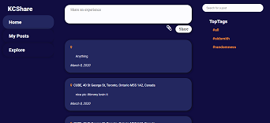 _Mobile_ 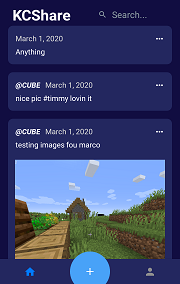

**To create posts:** Use the left bar Home button on web. Write a new post in the box at the top centre, attach an image if desired, and click Share. On mobile, use the bottom centre ‘+’ button to reach a screen where a new post can be written, an image can be attached, and the post can be shared.

_Web_ 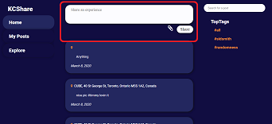 _Mobile_ 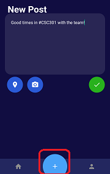

**To delete posts:** This feature will only be available on one’s own posts when accounts have been integrated, but the method will remain the same. For web and mobile, press the trash can icon on the top right of a post and confirm your decision at the confirmation pop-up. On mobile, use the "..." button at the top right to choose to delete a post.

_Web_ 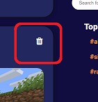 _Mobile_ 

**To view your own posts:** On web, click the left bar My Posts button to view a feed containing only your own posts. On mobile, tap the bottom right profile button and ensure that “My Posts” is selected at the top right on the Profile screen.

_Web_ 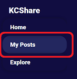 _Mobile_ 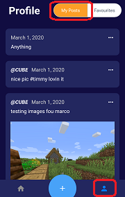

**To search by hashtag:** On web, click one of the Top Tags listed on the right bar, or enter a hashtag search term in the top right search bar and hit Enter/Return to make the search. On mobile, ensure that you’re on the Home screen/main feed (bottom left Home button), tap the top right search bar, and either tap one of the Top Tags listed or enter a search term and the app will automatically make a search on what you’ve typed after a short delay.

_Web_ 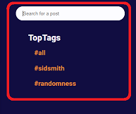 _Mobile_ 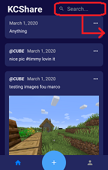 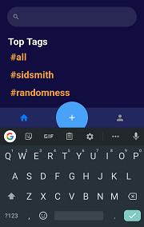

**Search by location (web only):** On the web app only, click Explore on the left bar. Clicking an icon on the map will bring up the post that was made from that location.

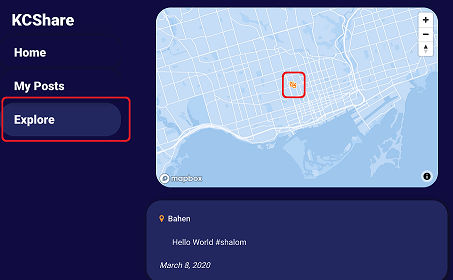

## Development requirements

### Backend

To make changes to the backend, navigate to http://aws.amazon.com/ and log in to the team account. This requires our team’s AWS credentials, which can be provided to course staff on request.

### Web

Install node.js and npm package manager. Once the project repo is cloned navigate to the frontend-web/ folder from the command line. Run the command `npm install` which will populate the node_modules/ folder for all required dependencies that are not attached to the repo. This command only needs to be run when new dependencies are added to the package.json. Once dependencies have finished installing, run the command `npm start` to begin hosting the website on your localhost (accessible by http://localhost:3000/ if your browser does not automatically open it). Once running, any time a js/css file is modified and saved it will automatically push those changes to your locally hosted site. These files are found in the public/ and src/ folders.

To deploy to the AWS site, you will need the AWS CLI installed and the AWS access keys as described above. Run the following commands:

```
npm run-script build
aws s3 sync ./build/ s3://kcsharewebsite
```

Once initial setup is complete the `npm start` command should suffice as the only 'go to' command that is needed.

The web app has been tested using Google Chrome.

### Mobile

As described in the Web setup above, ensure you have node.js and the npm package manager installed. Navigate into the frontend-mobile/ folder and run the command `npm install`. You will also need to download the “Expo” app from the Apple or Android app store.

Ensure that both your phone and computer used to run the mobile web app are on the same WiFi network. In the frontend-mobile/ folder, run the command `npm start`. A QR code will appear in your terminal - use the Expo app or your phone camera app to scan it. The link contained within will prompt the Expo app to run our app inside it.

Any changes made to files in the current folder and subfolders assets/ and components/ will be reflected in the Expo app when saved for live editing of the mobile application.

## Deployment and Github Workflow

We manage our project together using the Projects feature of our project repo to plan and manage tasks on a project management level, keeping us all organized and keeping the focus of the team visible to all.

As we develop our dynamic and workflow as a team of seven, we are learning how better to work on a big project with so many people. For this deliverable, we used only a small amount of branching and merging for several reasons: our team has well-defined boundaries between responsibilities for this deliverable, we often work together in person, and our communication has been strong. However, we learned from working on major features in one division of the team, where implementation relied on stable code from another division, that it would be best to have well-defined and structured branches for the different areas of development. For the next deliverable, we will establish these branches and this process in advance of working on any feature, whether the addition of a new feature or updates and maintenance on an existing one.

The backend code and API uses camelCase. Web and mobile frontends use camelCase for variable and function names, and PascalCase for class names.

The backend code is automatically deployed by AWS as it is written. This can be turned into a rolling deployment if necessary. The mobile frontend must be demoed using the Development Requirements instructions written above. The web frontend is deployed directly to an AWS S3 bucket (public cloud storage resource) - after building the web app from npm, a sync must be run from the AWS Command Line Interface (CLI), which then updates the web app at the url https://do8ba9uj6dn3a.cloudfront.net/.

## Licenses

We are using the [MIT License](https://choosealicense.com/licenses/mit/) for our codebase.

This license provides open source modification and adaptation for commercial use which is agreeable for our team and our partner (who may want to expand on our work after our team has moved on from this course). It protects our team from liability which is important to us as well. It also preserves some token of our contribution to the codebase in the case of any type of reuse.
